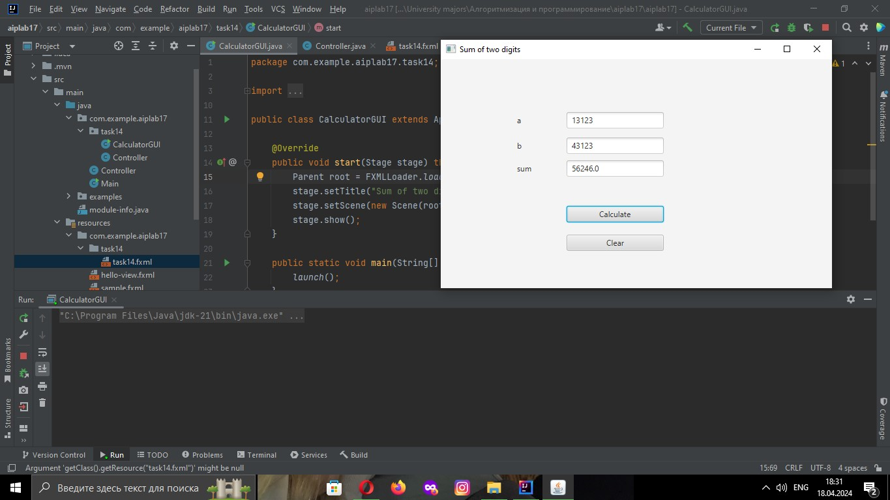
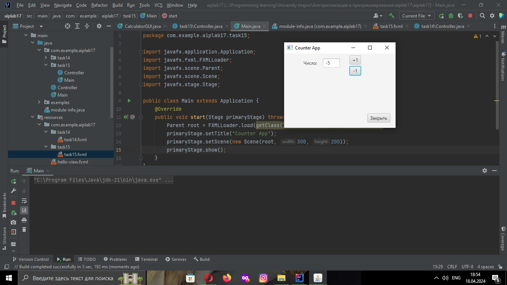

# Реализация лабораторной работы 14 на JavaFX

1. **CalculatorGUI.java:**
    - Этот класс представляет основной класс приложения, который расширяет класс Application из JavaFX.
    - Метод `start(Stage stage)` запускает приложение, загружая корневой элемент интерфейса из файла FXML `task14.fxml`.
    - Заголовок окна устанавливается как "Sum of two digits".
    - Создается сцена, на которой отображается корневой элемент интерфейса, заданная размером 600x300 пикселей.

2. **Controller.java:**
    - Этот класс является контроллером, который управляет логикой и взаимодействием с элементами интерфейса из файла FXML.
    - Метод `clickCalculate(ActionEvent calculating)` вызывается при нажатии кнопки "Calculate".
        - Он извлекает числа из текстовых полей, выполняет сложение и отображает результат в соответствующем текстовом поле.
        - В случае возникновения исключения `NumberFormatException`, связанного с некорректным вводом, выводится сообщение об ошибке.
    - Метод `clickClear(ActionEvent clearing)` вызывается при нажатии кнопки "Clear" и очищает все текстовые поля.

3. **task14.fxml:**
    - Этот файл описывает внешний вид интерфейса с использованием языка разметки FXML.
    - Он содержит разметку элементов управления, таких как текстовые поля (`TextField`), метки (`Label`) и кнопки (`Button`), расположенных на панели `AnchorPane`.
    - Каждый элемент управления имеет свой идентификатор (`fx:id`), который используется для связи с контроллером.
    - Методы контроллера `clickCalculate` и `clickClear` связываются с событиями нажатия кнопок.
# Отладка кода:

# Реализация лабораторной работы 15 на JavaFX

1. **Main.java:**
    - Этот класс представляет основной класс приложения, который расширяет класс Application из JavaFX.
    - Метод `start(Stage primaryStage)` запускает приложение, загружая корневой элемент интерфейса из файла FXML `task15.fxml`.
    - Заголовок окна устанавливается как "Counter App".
    - Создается сцена, на которой отображается корневой элемент интерфейса, заданная размером 300x200 пикселей.

2. **Controller.java:**
    - Этот класс является контроллером, который управляет логикой и взаимодействием с элементами интерфейса из файла FXML.
    - Метод `initialize()` вызывается при инициализации контроллера и обновляет поле числа.
    - Методы `handleIncrement(ActionEvent actionEvent)` и `handleDecrement(ActionEvent actionEvent)` увеличивают и уменьшают значение числа соответственно, при условии, что число находится в пределах от -5 до 3.
    - Метод `handleClose(ActionEvent actionEvent)` закрывает приложение.
    - Приватный метод `updateNumberField()` обновляет текстовое поле с числом.
    - Метод `clearNumberField(ActionEvent clearing)` вызывается при нажатии кнопки "Clear" и обнуляет значение числа.

3. **task15.fxml:**
    - Этот файл описывает внешний вид интерфейса с использованием языка разметки FXML.
    - Он содержит разметку элементов управления, таких как текстовые поля (`TextField`), метки (`Label`) и кнопки (`Button`), расположенных на панели `AnchorPane`.
    - Каждый элемент управления имеет свой идентификатор (`fx:id`), который используется для связи с контроллером.
    - Методы контроллера `handleIncrement`, `handleDecrement`, `handleClose` и `clearNumberField` связываются с событиями нажатия кнопок.

# Отладка кода:

